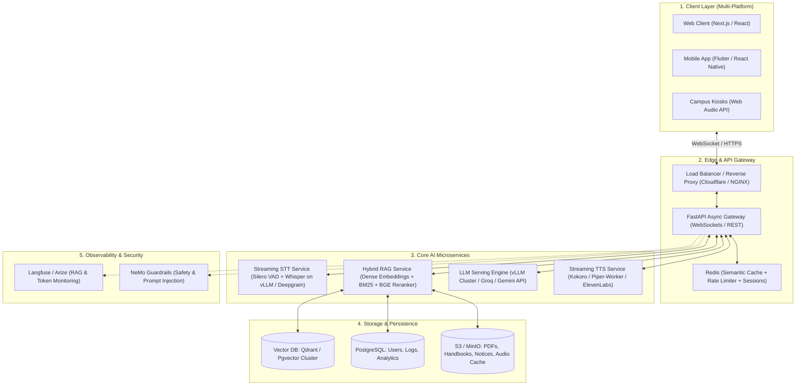
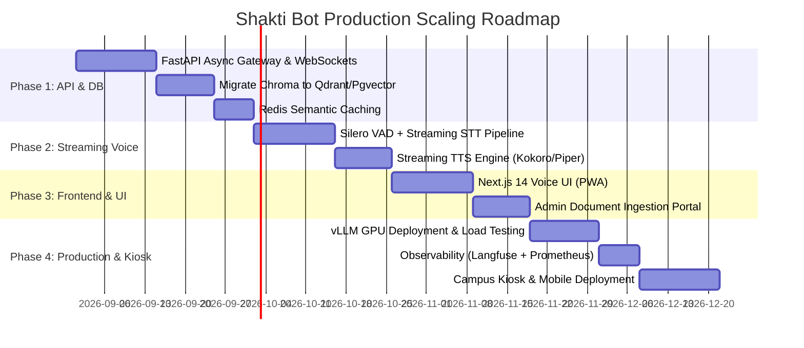

# Shakti Bot — Production Scaling & Architecture Roadmap

This document outlines the end-to-end technical roadmap, architectural blueprints, and migration steps required to scale **Shakti Bot** from a local, single-user Mac prototype into a high-concurrency, low-latency, enterprise-grade AI voice assistant for college students, staff, and visitors.

---

## 1. Executive Architecture Overview



---

## 2. Comparison: Current Prototype vs. Production Architecture

| Dimension | Current Prototype (`app.py`) | Production Scaled Architecture |
|---|---|---|
| **Frontend Framework** | Streamlit (Python script-runner) | **Next.js 14 / React (Web) + Flutter (iOS & Android)** |
| **API & Concurrency** | Single-process blocking Python | **Async FastAPI with Gunicorn/Uvicorn worker pool + WebSockets** |
| **Voice Processing** | Web Speech API / Batch disk write | **Full-duplex WebSocket audio streaming (Opus codec)** |
| **Voice Detection (VAD)** | Client-side naive pause timeout | **Silero VAD (sub-10ms voice activity boundary detection)** |
| **Speech-to-Text (STT)** | Local CPU `faster-whisper` (Batch) | **Batched GPU Whisper Workers (vLLM/Triton) or Deepgram Nova-2** |
| **Text-to-Speech (TTS)** | Piper batch WAV file to temp disk | **Streaming token-by-token TTS (Kokoro / Piper / ElevenLabs)** |
| **Time to First Spoken Word** | **3.5 – 6.0 seconds** | **300 – 600 milliseconds** |
| **Vector Database** | Local SQLite Chroma directory (`chroma_db/`) | **Qdrant / Pgvector / Milvus cluster with replication** |
| **Search Method** | Dense embedding retrieval only | **Hybrid Search: Dense Vector + Sparse BM25 + Cross-Encoder Rerank** |
| **LLM Serving** | Local Ollama (`qwen3:4b` on CPU/Apple GPU) | **vLLM / TGI GPU Cluster (AWS L4/A10G) or Cloud API Fallback** |
| **Caching Layer** | None (calculates every question) | **Redis Semantic Cache (sub-50ms cache hits for common FAQs)** |
| **Observability** | Terminal prints (`print`) | **Langfuse tracing, Prometheus metrics, Grafana dashboards** |

---

## 3. Detailed Component Breakdown & Implementation Guide

### 3.1. Frontend Decoupling (Next.js + Web Audio API)

Streamlit is designed for data dashboards, not interactive low-latency voice apps. Moving to a dedicated frontend provides:
- **Audio Worklet Processor**: Stream raw microphone PCM audio in chunks of 50ms over a WebSocket without UI lag.
- **Visual Waveforms & Audio Feedback**: Real-time canvas animations showing speaking, listening, and thinking states.
- **PWA (Progressive Web App) & Mobile**: Students can install the assistant directly on iPhone and Android homescreens with offline assets.

### 3.2. Real-Time Full-Duplex Voice Engine

In production, audio flows continuously over a bi-directional WebSocket:

```
[User Mic]
   │
   ▼
[AudioWorklet: 16kHz 16-bit PCM (50ms chunks)]
   │
   ▼ WebSocket
[FastAPI Gateway]
   ├──▶ [Silero VAD] (Detects when user starts and stops talking)
   ├──▶ [Whisper Streaming Engine] (Transcribes text in real-time)
   │
   ▼ (Finalized sentence)
[Hybrid RAG Engine] (Retrieves top chunks in <40ms)
   │
   ▼
[LLM (Streaming)] (Outputs tokens incrementally)
   │
   ▼
[Streaming TTS (Kokoro / Piper)] (Synthesizes audio on first complete phrase)
   │
   ▼ WebSocket Audio Chunks
[Client Speaker Buffer] (Audio begins playing in <500ms)
```

### 3.3. Enterprise-Grade Hybrid RAG & Ingestion Pipeline

To ensure the assistant answers complex questions accurately (e.g. syllabus codes, specific fee slabs, faculty designations):

1. **Hybrid Retrieval**:
   - **Dense Vectors** (`bge-large-en-v1.5` or `nomic-embed-text-v1.5`) capture semantic meaning.
   - **BM25 Sparse Search** captures exact names, acronyms, and course codes (*"MHT-CET cutoff for CSE"*, *"Dr. Karad"*).
   - Combine with **Reciprocal Rank Fusion (RRF)**.
2. **Cross-Encoder Reranking**:
   - Run candidate chunks through `bge-reranker-large` or `Cohere Rerank` to filter irrelevant noise before feeding the LLM.
3. **Async Document Ingestion Portal**:
   - Admin portal allowing college departments to upload PDFs, notices, and syllabi.
   - Background worker (Celery / RQ) parses with PyMuPDF, chunks dynamically (using semantic boundary detection), and updates the vector database without downtime.

---

## 4. Scalability, Caching & Performance Optimizations

### 4.1. Semantic FAQ Caching with Redis
Over 60% of student and visitor questions are duplicates:
- *"What is the hostel fee?"*
- *"Where is the campus located?"*
- *"What documents are needed for B.Tech admission?"*

**Implementation**:
1. When a question arrives, compute its embedding.
2. Search Redis Vector index for an existing question with similarity $\ge 0.96$.
3. If matched, return the pre-generated answer and cached TTS audio stream **in < 50ms**, completely bypassing the LLM and TTS pipelines.

### 4.2. GPU Worker Pool with vLLM
Instead of running Ollama on CPU:
- Deploy **vLLM** on Kubernetes or Docker with NVIDIA GPUs.
- vLLM utilizes **PagedAttention** and continuous request batching, enabling a single GPU (e.g., NVIDIA A10G 24GB) to serve **50–100 concurrent students** with 8B models (e.g., Llama-3.1-8B-Instruct or Qwen-2.5-7B-Instruct).

---

## 5. Security, Guardrails & Access Control

1. **Hallucination Mitigation**:
   - Enforce strict system instructions: *"Answer only using the provided retrieved context. If the document does not mention the detail, politely state that the official information is not in the uploaded records."*
   - Add citations (`[Source: Student_Handbook_2025.pdf, Page 14]`) for student trust.
2. **Prompt Injection & Topic Guardrails**:
   - Use **NeMo Guardrails** or an input classifier to block prompt leaks, malicious overrides, and non-college-related tasks.
3. **Rate Limiting & Abuse Prevention**:
   - Token bucket rate limiter in Redis (e.g., max 30 voice queries/min per IP/student token).

---

## 6. Phased Implementation Roadmap



### Phase 1: Backend Decoupling & Vector DB Migration (Weeks 1–3)
- [x] Implement async **FastAPI** backend with `/chat`, `/ingest`, `/voices`, and `/health` endpoints.
- [x] Migrate vector storage from local SQLite Chroma to **Qdrant**.
- [x] Implement **Redis Semantic Cache** (exact + cosine-semantic, TTL, model-gated).

### Phase 2: Low-Latency Streaming Audio Pipeline (Weeks 4–6)
- [ ] Implement WebSocket server with **Silero VAD** integration.
- [ ] Implement streaming token-to-speech audio synthesis.
- [ ] Add domain hotword biasing to Whisper transcription.

### Phase 3: Production Client & Admin Portal (Weeks 7–9)
- [ ] Build **Next.js** responsive PWA with live audio visualizer and voice wake word.
- [ ] Build admin dashboard with role-based login to upload new PDFs, brochures, and announcements.
- [ ] Implement hybrid search (BM25 + Dense embeddings) + BGE Reranker.

### Phase 4: GPU Cluster Deployment & Monitoring (Weeks 10–12)
- [ ] Deploy **vLLM** engine on Kubernetes / AWS ECS with auto-scaling.
- [ ] Configure **Langfuse** for token cost, latency tracking, and hallucination monitoring.
- [ ] Deploy dedicated on-campus physical touch/voice kiosks.
